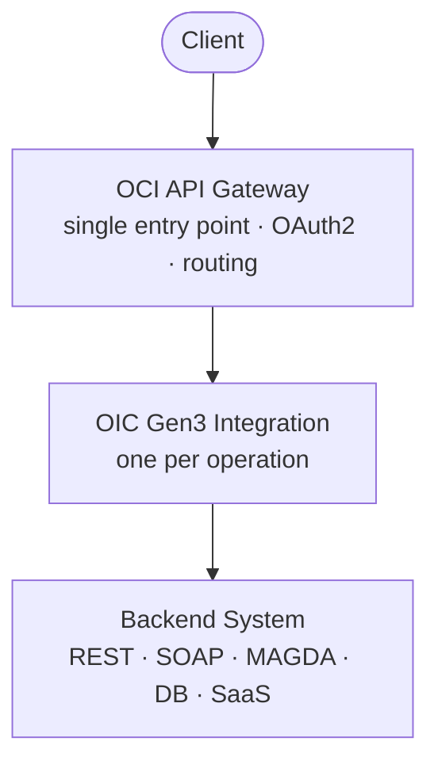
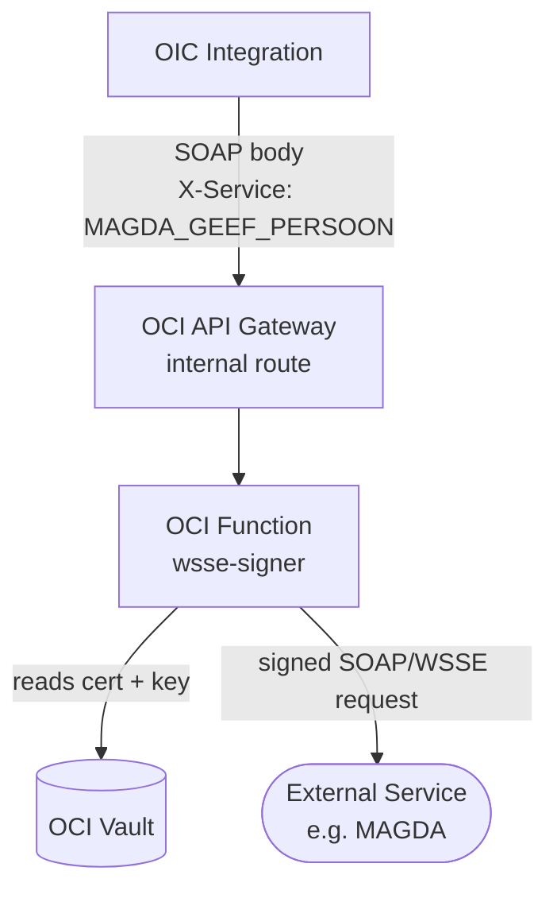
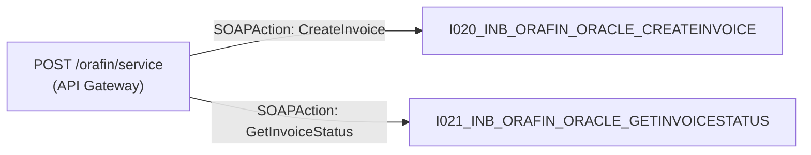

# Integration Developer Guide
### OIC Gen3 + OCI API Gateway

---

## 1. Overview

This guide explains how to build and expose integrations using Oracle Integration Cloud Gen3 (OIC Gen3) and OCI API Gateway.

**The basic rule:** OIC does the integration work. API Gateway is the single entry point for all consumers. OIC endpoints are never exposed directly.

- OIC handles orchestration, transformation, and connectivity to backends
- API Gateway handles routing, security, and versioning
- Every integration — REST or SOAP — follows the same pattern: one OIC integration per operation
- All responses use the **status envelope**: `{ status, <data>|errors[] }` — never raw fields at root level

> **Reference implementation:** PartijHub (`I038_INB_PARTIJHUB_MAGDA_GETPERSON`) — when in doubt, look at `apis/partijhub/` for a working example.

---

## 2. Architecture Flow

Standard flow — client through API Gateway to OIC to backend:



For external services that require message signing (e.g. MAGDA):



---

## 3. Integration Naming Convention

```
I{number}_INB_{PROJECT}_{SOURCE}_{ACTION}
```

| Part | Description | Example |
|------|-------------|---------|
| `I{number}` | Sequential integration number (zero-padded to 3 digits) | `I038` |
| `INB` | Direction: **IN**bound (triggered from API Gateway) | `INB` |
| `{PROJECT}` | Project/domain code | `PARTIJHUB` | --> in SDD this is a Source. not the project.
| `{SOURCE}` | Source or backend system being called | `MAGDA` |
| `{ACTION}` | What the integration does | `GETPERSON` |

**Examples across projects:**

| Project | Operation | Integration Name |
|---------|-----------|-----------------|
| PartijHub | Get person from MAGDA | `I038_INB_PARTIJHUB_MAGDA_GETPERSON` |
| PartijHub | Get enterprise from MAGDA | `I039_INB_PARTIJHUB_MAGDA_GETENTERPRISE` |
| MDM | Create bank branch | `I010_INB_MDM_ORACLE_CREATEBANKBRANCH` |
| OraFin | Create invoice | `I020_INB_ORAFIN_ORACLE_CREATEINVOICE` |

> The integration number is assigned sequentially. Reserve a number from the CMDB register before creating the integration.

---

## 4. Response Envelope Pattern

All integrations in this project use a **status envelope** — a consistent structure for both success and error responses. The `status` field is the runtime discriminator.

### Success

```json
{
  "status": "SUCCESS",
  "person": { ... }
}
```

### Error

```json
{
  "status": "FAILED",
  "errors": [
    {
      "code": "PERSON_NOT_FOUND",
      "message": "No person found for KSZ:80010120990"
    }
  ]
}
```

`errors` is always an array — multiple errors can be returned:

```json
{
  "status": "FAILED",
  "errors": [
    {
      "code": "MAGDA_FAULT",
      "message": "MAGDA returned an exception",
      "details": {
        "identification": "urn:be:magda:...",
        "diagnose": "Person not found in KSZ register"
      }
    }
  ]
}
```

### Rules

- `status` is always present: `"SUCCESS"` or `"FAILED"` — never omit it
- `errors` is always an array — minimum 1 item when status is `"FAILED"`
- The data property name matches the resource: `person`, `enterprise`, `invoice`, etc.
- Optional fields are **omitted** when absent — no `null` values
- HTTP status code must be consistent with `status`: `200` → `SUCCESS`, `4xx/5xx` → `FAILED`

### Standard error codes

Define error codes per domain. The PartijHub domain uses:

| Code | HTTP | Meaning |
|------|------|---------|
| `INVALID_PARTY_NUMBER` | 400 | Request validation failed |
| `PERSON_NOT_FOUND` | 404 | Resource not found in backend |
| `ADDRESS_NOT_FOUND` | 422 | Business rule: required data missing |
| `MAGDA_FAULT` | 422 | Backend returned a domain error |
| `UPSTREAM_ERROR` | 502 | Backend unreachable or unexpected error |

Use these as a template — adapt codes to your domain, but keep the HTTP mapping consistent.

---

## 5. OIC Gen3 Polymorphic XSD Pattern

OIC Gen3's REST adapter trigger requires an **XSD schema** for the response payload — not a JSON schema. One XSD covers both success and error responses.

### Why polymorphic

- OIC Gen3 has one configured response schema per trigger
- The same schema must handle both success and fault handler outputs
- `status` is always mapped — it's the discriminator
- The data element (`person`, `enterprise`, etc.) is optional (`minOccurs="0"`)
- `errors` uses `maxOccurs="unbounded"` — OIC Gen3 serializes this as a JSON array automatically

### XSD pattern

```xml
<xs:complexType name="GetPersonResponseType">
  <xs:sequence>
    <!-- Always present: SUCCESS or FAILED -->
    <xs:element name="status"  type="StatusType"         minOccurs="1" maxOccurs="1"/>
    <!-- Filled on SUCCESS -->
    <xs:element name="person"  type="PersonResponseType" minOccurs="0" maxOccurs="1"/>
    <!-- Filled on FAILED; maxOccurs=unbounded → JSON array -->
    <xs:element name="errors"  type="ErrorItemType"      minOccurs="0" maxOccurs="unbounded"/>
  </xs:sequence>
</xs:complexType>

<xs:simpleType name="StatusType">
  <xs:restriction base="xs:string">
    <xs:enumeration value="SUCCESS"/>
    <xs:enumeration value="FAILED"/>
  </xs:restriction>
</xs:simpleType>
```

For a different resource, replace `person` with your resource element. The `status` and `errors` pattern stays the same.

**PartijHub reference XSD:** `apis/partijhub/schemas/response/get-person-response.xsd`

### XSD naming convention

```
apis/{domain}/schemas/response/{operation}-response.xsd
```

Example: `apis/partijhub/schemas/response/get-person-response.xsd`

### OIC mapping pattern

| Branch | OIC mapper actions |
|--------|-------------------|
| Success scope | `status = "SUCCESS"`, map `person/*` (or your resource) from backend response |
| Fault handler | `status = "FAILED"`, set `errors[0]/code` and `errors[0]/message` |

> Configure the REST adapter trigger response with the XSD and **select the root element**. OIC Gen3 converts the XML to JSON automatically — `maxOccurs="unbounded"` becomes a JSON array.

---

## 6. Step-by-Step Guide

### 6.1 Define Your API

Before writing any code, define what the API looks like from the consumer's perspective.

- Use versioned resource paths from day one: `/v1/persons/{partyNumber}`
- Map each HTTP method + resource to one integration
- Document in OpenAPI 3.0 JSON before building
- Store specs in `apis/{domain}/spec/`

**Example — PartijHub:**

| Method | Path | OIC Integration |
|--------|------|-----------------|
| GET | `/v1/persons/{partyNumber}` | `I038_INB_PARTIJHUB_MAGDA_GETPERSON` |
| GET | `/v1/enterprises/{partyNumber}` | `I039_INB_PARTIJHUB_MAGDA_GETENTERPRISE` |

---

### 6.2 Create the OpenAPI Spec

**Spec location:** `apis/{domain}/spec/{domain}-api-v{version}.json`
**Reference:** `apis/partijhub/spec/partijhub-api-v1.0.0.json`

Key structural rules:
- All responses use `$ref` to `components/responses` — no inline schemas on operations
- All parameters defined once in `components/parameters`
- `operationId` on every operation: camelCase, verb + noun (`getPersonByPartyNumber`)
- `tags` defined at spec level and applied to all operations
- `servers` block includes all environments (DEV, SIT, UAT, PRD)
- `additionalProperties: false` on all schemas
- `required` arrays on all schemas
- `enum` on `status` — lock to `"SUCCESS"` or `"FAILED"`

**Minimal spec skeleton:**

```json
{
  "openapi": "3.0.0",
  "info": { "version": "1.0.0", "title": "My API" },
  "tags": [{ "name": "MAGDA", "description": "..." }],
  "servers": [
    { "url": "https://api.orion-dev.online/{domain}/{source}", "description": "DEV" }
  ],
  "paths": {
    "/v1/persons/{partyNumber}": {
      "get": {
        "tags": ["MAGDA"],
        "operationId": "getPersonByPartyNumber",
        "parameters": [{ "$ref": "#/components/parameters/PartyNumberParam" }],
        "responses": {
          "200": { "$ref": "#/components/responses/PersonOkResponse" },
          "400": { "$ref": "#/components/responses/InvalidPartyNumberResponse" },
          "404": { "$ref": "#/components/responses/PersonNotFoundResponse" },
          "422": { "$ref": "#/components/responses/UnprocessableEntityResponse" },
          "502": { "$ref": "#/components/responses/UpstreamErrorResponse" }
        }
      }
    }
  },
  "components": { "..." : "..." }
}
```

---

### 6.3 Create the OIC Gen3 Integration

1. Log in to OIC Gen3 → **Integrations** → **Create**
2. Choose **App Driven Orchestration**
3. Name it using the convention: `I038_INB_PARTIJHUB_MAGDA_GETPERSON`
4. Add a **REST Adapter** trigger:
   - Resource URI: match your API path (e.g. `/persons/{partyNumber}`)
   - Method: `GET`, `POST`, etc.
   - Response payload: upload your polymorphic XSD
   - Select the **root element** (e.g. `GetPersonResponse`)
5. Add the invoke connection to your backend
6. Add a **Success scope** and a **Fault handler**

> Always use the XSD for the response schema — not a JSON sample. The XSD drives the OIC mapper and JSON serialization.

---

### 6.4 Implement the Logic

Keep integrations focused. Each one does one thing.

**Typical flow inside an OIC Gen3 integration:**

```
1. Receive trigger request
2. Validate input (path params, headers, body)
   → If invalid: status=FAILED, errors=[{code, message}], return 4xx
3. Build backend request (SOAP envelope, REST body, etc.)
4. Call backend (via WSSE signer for MAGDA, direct for REST/SOAP)
5. Handle backend errors:
   → Domain error (e.g. Uitzondering): status=FAILED, errors=[{code:MAGDA_FAULT, details}]
   → Not found: status=FAILED, errors=[{code:NOT_FOUND}]
   → Connection error: status=FAILED, errors=[{code:UPSTREAM_ERROR}]
6. Map backend response to status envelope
   → status=SUCCESS, <resource>={...mapped fields...}
7. Return response
```

**Tips:**
- Use OIC mapper for field-level transformations
- Use JavaScript libraries (in `integrations/oic/libraries/`) for complex logic
- Load secrets (credentials, endpoints) from OCI Vault — never hardcode them
- Always define a fault handler — every integration must handle errors

---

### 6.5 Deploy the Integration

1. Toggle to **Activate** in the OIC integration list
2. Enable tracing for non-production environments
3. Note the OIC endpoint URL:
   ```
   https://<oic-host>/ic/api/integration/v1/flows/rest/<INTEGRATION_NAME>/1.0/<resource>
   ```
4. Test the OIC endpoint directly before wiring to API Gateway:
   ```bash
   curl -X GET \
     "https://<oic-host>/ic/api/integration/v1/flows/rest/I038_INB_PARTIJHUB_MAGDA_GETPERSON/1.0/persons/KSZ:80010120990" \
     -H "Authorization: Bearer <token>"
   ```

---

### 6.6 Expose via API Gateway

1. OCI Console → **API Gateway** → select gateway → open deployment
2. Add a route per integration:
   ```yaml
   path: /v1/persons/{partyNumber}
   methods: [GET]
   backend:
     type: HTTP_BACKEND
     url: https://<oic-host>/ic/api/integration/v1/flows/rest/I038_INB_PARTIJHUB_MAGDA_GETPERSON/1.0/persons/{partyNumber}
   ```
3. Pass through the `Authorization` header
4. Apply the OAuth2 authorizer

> **Never expose OIC endpoints directly to consumers.** All traffic goes through API Gateway.

---

### 6.7 Configure Security

**Auth flow:**
```
Client → OAuth2 token from IDCS → API Gateway (validates) → OIC
```

**OAuth2 security scheme (OCI Sovereign Cloud EU):**

```json
"securitySchemes": {
  "oauth2Authentication": {
    "type": "oauth2",
    "flows": {
      "clientCredentials": {
        "tokenUrl": "https://idcs-{32-char-hex}.eu-frankfurt-idcs-2.identity.oci.oraclecloud.eu:443/oauth2/v1/token",
        "scopes": {
          "https://{oic-instance-id}.integration.eu-frankfurt-2.ocp.oraclecloud.{eu|com}urn:opc:resource:consumer::all": "scope description"
        }
      }
    }
  }
}
```

**OCI Sovereign Cloud specifics:**
- Domain: always `.oraclecloud.eu` (not `.com`)
- IDCS hostname: `idcs-{32-char-hex}.eu-frankfurt-idcs-2.identity.oci.oraclecloud.eu`
- Token endpoint includes `:443` before `/oauth2/v1/token`
- Scope: `https://{oic-instance-id}.integration.eu-frankfurt-2.ocp.oraclecloud.{eu|com}urn:opc:resource:consumer::all`

**PartijHub example (DEV):**
```json
"tokenUrl": "https://idcs-9c0bbd9587f5487db5b11534dd0102a8.eu-frankfurt-idcs-2.identity.oci.oraclecloud.eu:443/oauth2/v1/token",
"scopes": {
  "https://oic-dev1-ax4c9iiioovo-st.integration.eu-frankfurt-2.ocp.oraclecloud.comurn:opc:resource:consumer::all": "oic-dev1"
}
```

Apply security **per operation**, not globally. Do not use Basic Auth in production.

---

### 6.8 Versioning

- Version in the URL path from day one: `/v1/persons/{partyNumber}`
- OIC version field: `1.0` (major only)
- API Gateway: one route per version
- Never make breaking changes to an existing version — create a new one

```
/v1/persons/{partyNumber}  → I038_INB_PARTIJHUB_MAGDA_GETPERSON v1.0
/v2/persons/{partyNumber}  → I038_INB_PARTIJHUB_MAGDA_GETPERSON v2.0
```

---

### 6.9 Testing

Test at each layer independently.

**Layer 1 — OIC directly (bypass API Gateway):**
- Use curl or Postman with the OIC endpoint and OIC token
- Verify input validation, backend call, and response mapping

**Layer 2 — API Gateway route:**
- Test with a valid OAuth2 token through the API Gateway URL
- Verify routing, auth enforcement, header passthrough

**Layer 3 — End-to-end:**
- Test with realistic data
- Test error paths: invalid input, resource not found, backend down

**Quick curl test:**
```bash
curl -X GET "https://api.orion-dev.online/partijhub/magda/v1/persons/KSZ:80010120990" \
  -H "Authorization: Bearer <token>"
```

---

## 7. REST Guidelines

### Resource naming

- Nouns, not verbs: `/persons`, not `/getPersons`
- Lowercase and hyphens for multi-word: `/bank-branches`
- Nest only when there's a clear parent-child: `/invoices/{id}/lines` — max 2 levels
- Versioned from day one: `/v1/...`

### HTTP methods

| Method | Use for | Example |
|--------|---------|---------|
| GET | Retrieve | `GET /v1/persons/{partyNumber}` |
| POST | Create | `POST /v1/invoices` |
| PUT | Replace / upsert | `PUT /v1/bank-branches/{id}` |
| PATCH | Partial update | `PATCH /v1/persons/{id}` |
| DELETE | Remove | `DELETE /v1/invoices/{id}` |

**Upsert pattern:** For master data, use `PUT` on the collection — idempotent create-or-update.

### HTTP status codes

| Code | When |
|------|------|
| 200 | Success — GET, PUT, PATCH |
| 201 | Resource created — POST |
| 204 | Success, no content — DELETE |
| 400 | Bad request, validation error → `FAILED` + error code |
| 401 | Not authenticated |
| 403 | Authenticated, not authorized |
| 404 | Resource not found → `FAILED` + `_NOT_FOUND` code |
| 422 | Business rule violation → `FAILED` + domain error code |
| 502 | Backend unreachable → `FAILED` + `UPSTREAM_ERROR` |

### Operation IDs

camelCase, verb + noun:

| Pattern | Example |
|---------|---------|
| get by key | `getPersonByPartyNumber` |
| get all | `getPersons` |
| upsert | `upsertBankBranch` |
| create | `createInvoice` |
| update | `updateBankBranch` |
| delete | `deleteInvoice` |

### Field naming

- camelCase for all field names
- `code`/`description` sub-objects for coded values (register, gender, status codes)
- ISO dates: `YYYY-MM-DD`
- ISO 3166-1 alpha-3 for countries: `BEL`, `NLD`
- No `null` values — omit optional fields when absent

### Tags

Group operations by backend or resource. Define each tag at the spec level:

```json
"tags": [
  { "name": "MAGDA", "description": "API Resources to interact with MAGDA" }
]
```

---

## 8. SOAP Guidelines

SOAP is used for legacy services. The rule is: do not change the existing WSDL contract.

### How it works

- API Gateway exposes one SOAP endpoint (e.g. `/orafin/service`)
- Routing is based on the `SOAPAction` header
- Each SOAP operation maps to exactly one OIC integration



### API Gateway routing for SOAP

Route on the `SOAPAction` header. For dynamic routing, use an OCI Function or routing policy:

```yaml
routes:
  - path: /orafin/service
    methods: [POST]
    backend:
      type: HTTP_BACKEND
      url: https://<oic-host>/ic/api/integration/v1/flows/rest/I020_INB_ORAFIN_ORACLE_CREATEINVOICE/1.0/
    requestPolicies:
      headerValidation:
        headers:
          - name: SOAPAction
            required: true
```

### OIC SOAP integration

1. Create App Driven Orchestration
2. Add **SOAP Adapter** as trigger — import the existing WSDL unchanged
3. Map SOAP request to backend and back

> Keep the WSDL untouched. If the legacy service changes its contract, update the OIC trigger — never change the API Gateway contract.

---

## 9. External Services Pattern — WSSE Signing (MAGDA)

External services like MAGDA require SOAP requests signed with a WSSE client certificate. OIC Gen3 cannot sign with OCI Vault certificates natively.

### Solution: wsse-signer OCI Function

The `wsse-signer` function (Java, `integrations/functions/shared/wsse-signer/`) handles:
1. Receiving the SOAP body from OIC
2. Reading certificate + private key from OCI Vault
3. Adding the WSSE security header to the SOAP envelope
4. Forwarding the signed request to MAGDA
5. Returning the MAGDA response to OIC

### OIC → wsse-signer call

```
POST https://<apigw-internal-host>/internal/sign-and-forward
Headers:
  X-Service: MAGDA_GEEF_PERSOON
  Content-Type: text/xml
Body: <SOAP envelope>
```

OIC only sets `X-Service`. The function owns the mapping from `X-Service` → endpoint + SOAPAction.

### Service registry

| X-Service | MAGDA Service | SOAPAction |
|-----------|---------------|------------|
| `MAGDA_GEEF_PERSOON` | GeefPersoon v02.02 | `GeefPersoon` |
| `MAGDA_GEEF_ONDERNEMING` | GeefOnderneming v02.00 | `GeefOnderneming` |

### Vault secrets naming convention

```
magda-cert-{env}      → PEM certificate
magda-key-{env}       → PEM private key
magda-identificatie   → MAGDA Identificatie (KBO number)
magda-hoedanigheid    → MAGDA Hoedanigheid context
```

### MAGDA WSDL/XSD references

```
apis/magda/spec/GeefPersoon/       → GeefPersoon v02.02
apis/magda/spec/GeefOnderneming/   → GeefOnderneming v02.00
```

### IAM setup

- wsse-signer needs a dynamic group with `read secret-family` on the Vault
- Internal API Gateway route `/internal/sign-and-forward` must be restricted to OIC's IP range

### Why this pattern works

- Certificate management stays in OCI Vault — never in OIC or code
- Adding a new MAGDA service = add a service registry entry + cert in Vault
- OIC stays simple — just sets `X-Service`, posts the body
- The function is independently testable

---

## 10. Documentation

- Publish an OpenAPI 3.0 JSON spec for every API
- Store in `apis/{domain}/spec/{domain}-api-v{version}.json`
- Store separate JSON schemas in `apis/{domain}/schemas/`
- Store the OIC Gen3 XSD in `apis/{domain}/schemas/response/`
- Include:
  - Description of each endpoint
  - Request/response examples with `examples` blocks in `components/responses`
  - All error codes and their meaning
  - Auth requirements and scopes
  - MAGDA field mappings where applicable (XPath → Oracle TCA column)

---

## 11. Best Practices

### ✅ Do

- One OIC integration per API operation
- Use the polymorphic XSD for OIC Gen3 REST adapter trigger response
- Always include `status` in the response — `SUCCESS` or `FAILED`
- Return the correct HTTP status code consistent with the `status` field
- Use resource-based REST naming (`/persons/{partyNumber}`, not `/getPersonById`)
- Version APIs in the URL path from the start (`/v1/...`)
- Store OpenAPI specs and XSDs in source control
- Store all secrets and certificates in OCI Vault
- Call MAGDA only via the wsse-signer function
- Enable tracing in OIC for non-production environments
- Set `additionalProperties: false` on all JSON schemas
- Test each layer independently before end-to-end testing
- Omit optional fields when absent — no `null` values

### ❌ Don't

- Expose OIC endpoints directly to clients — always go through API Gateway
- Use Basic Auth in production
- Return `null` for optional fields — omit them
- Use verbs in REST resource paths
- Put multiple operations in one OIC integration
- Change an existing API version in a breaking way — create a new version
- Hardcode MAGDA endpoint URLs in OIC — use the wsse-signer service registry
- Store credentials or certificates in OIC connection config as plain text
- Skip fault handlers — every integration must define one
- Return a flat root-level structure — always use the status envelope

---

## 12. Checklist

Use this before you consider an integration done.

### API Design
- [ ] API spec defined in OpenAPI 3.0 JSON
- [ ] Resource paths follow naming conventions (nouns, lowercase, versioned `/v1/...`)
- [ ] Each HTTP method + resource maps to exactly one OIC integration
- [ ] Integration named using convention: `I{num}_INB_{PROJECT}_{SOURCE}_{ACTION}`
- [ ] `operationId` set on every operation (camelCase, verb + noun)
- [ ] `tags` defined at spec level and applied to all operations
- [ ] `servers` block includes all environments
- [ ] Spec stored in `apis/{domain}/spec/`

### Response Schema
- [ ] All success responses use `{ status: "SUCCESS", <resource>: {...} }` envelope
- [ ] All error responses use `{ status: "FAILED", errors: [{code, message}] }` envelope
- [ ] `additionalProperties: false` on all schemas
- [ ] `status` enum locked: `"SUCCESS"` or `"FAILED"`
- [ ] Optional fields are absent (not null) when not populated
- [ ] All schemas have `required` arrays and examples

### XSD (OIC Gen3)
- [ ] Polymorphic XSD created: `status` + optional `<resource>` + unbounded `errors`
- [ ] Root element name matches the operation (e.g. `GetPersonResponse`)
- [ ] XSD is namespace-free for OIC JSON conversion
- [ ] XSD stored in `apis/{domain}/schemas/response/`

### OIC Integration
- [ ] REST adapter trigger configured with polymorphic XSD as response schema
- [ ] Root element selected in trigger config
- [ ] Success scope sets `status = "SUCCESS"` + maps resource fields
- [ ] Fault handler sets `status = "FAILED"` + maps error fields
- [ ] Secrets (credentials, endpoints) loaded from OCI Vault
- [ ] Tracing enabled (non-prod)
- [ ] Integration activated

### API Gateway
- [ ] Route configured for each OIC integration
- [ ] Path parameters mapped correctly
- [ ] OAuth2 authorizer applied
- [ ] OIC endpoint NOT directly accessible by consumers

### SOAP (if applicable)
- [ ] WSDL contract unchanged
- [ ] Routing based on `SOAPAction` header
- [ ] One OIC integration per SOAP operation

### MAGDA / WSSE Signing (if applicable)
- [ ] Certificate and key stored in OCI Vault
- [ ] wsse-signer function deployed and tested independently
- [ ] `X-Service` value registered in wsse-signer service registry
- [ ] Internal API Gateway route restricted to OIC traffic
- [ ] IAM policy grants function access to Vault secrets

### Testing
- [ ] OIC integration tested directly (bypass API Gateway)
- [ ] Happy path tested → correct `SUCCESS` response
- [ ] Invalid input tested → 400 `FAILED`
- [ ] Resource not found tested → 404 `FAILED`
- [ ] Business rule violation tested → 422 `FAILED`
- [ ] Backend unreachable tested → 502 `FAILED`
- [ ] API Gateway route tested with valid token
- [ ] Auth failure tested → 401

### Documentation
- [ ] OpenAPI spec published
- [ ] Error codes and meaning documented
- [ ] Auth requirements and scopes documented
- [ ] MAGDA field mappings documented (XPath → Oracle TCA column) if applicable
